# Harry Potter Quiz
Harry Potter Quiz is a game to test the knowledge of the film & book franchises. The aim of the website is to attract fans of Harry potter to interact with the game and see how high they can score. They are able to keep track of what number question they are on as well as how they are doing out of the 10 questions. At the end of the 10 questions they will also be informed of their final score and given the option to restart the quiz.

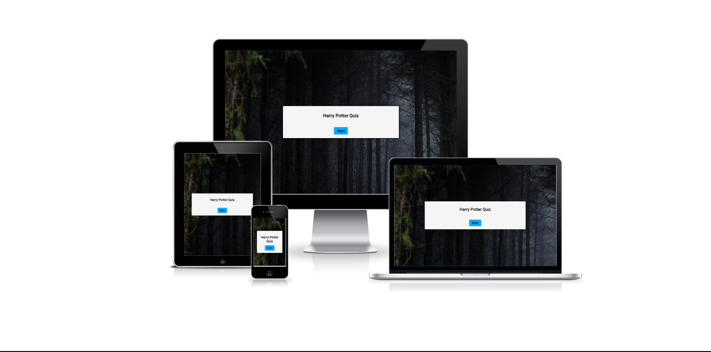

## UX/UI
- Careful thought was put into this website to make it as attractive & as easy to navigate to the user as possible. 
- Roboto is the font used in the quiz. The simplistic nature of this font does not make a fuss on the site which it what it was all about. I wanted the quiz to be as immersive and easy to interact with as possible.
- Once the user gets into the quiz they will start to see the interactivity & experience what it is all really about. Every click of a button elicits a response and should make the user want to experience more.   
- When the user gets an answer wrong the buttons for wrong answers all turn red and no point is scored. The right answer is shown in green. 
- When the user gets the right answer the button they selected goes green and a point is added to their score out of 10. 
- At the end of the quiz the user gets to see what they scored out of 10 and has the option to restart the quiz. 

## Features

### Existing Features

- **Background Image**
    -  The background image for the quiz is The Forbidden Forest. This is a very well known and loved part of the Harry Potter franchise. Although it could come across as eery and a bleak place and the fact that students were forbidden from entering it, it played a key part in the movies & books. Harry was almost killed in the forest and a lot of fans will know it as not the place in which Voldemort killed Harry. It was the place where Harry finally understood what he needed to do, the place where he saw his loved ones, and the place where he came back to life. I felt this was an important element to have in the background for this and feel that the real fans would catch on to it there too. 

- **Landing Page**
    - The landing page brings the user straight to the start of the quiz. All you have to do from here is hit the start button in blue and you will be brought into the quiz. 
    - From here you will be asked 10 multiple choice questions on the Harry Potter franchise at random.  

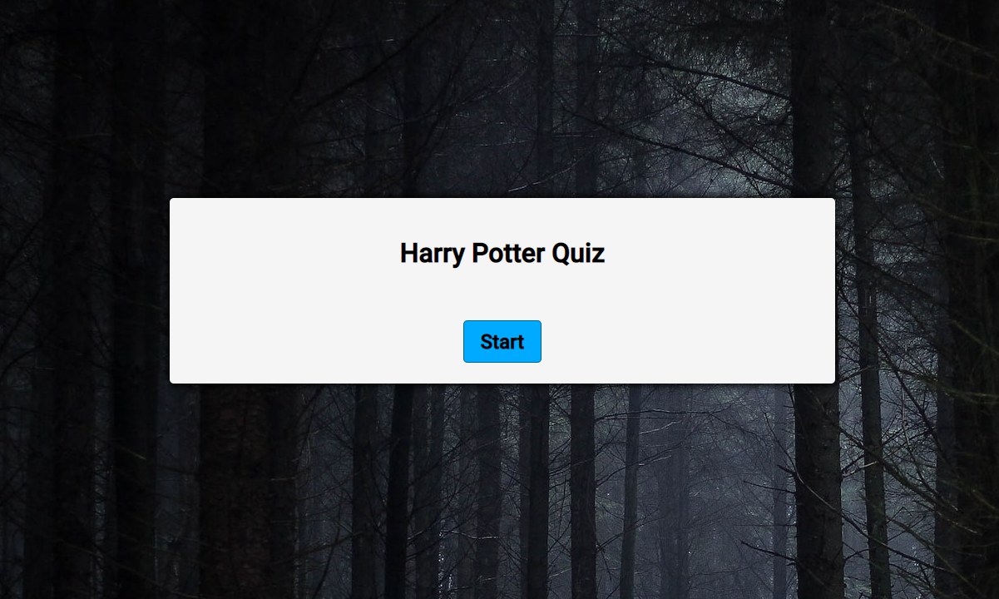

- **Questions**
    - You will be presented with your 1st question. Each questions is multiple choice of 4 answers. The score will be present as 0/10 and the question will be presented as 1/10. 

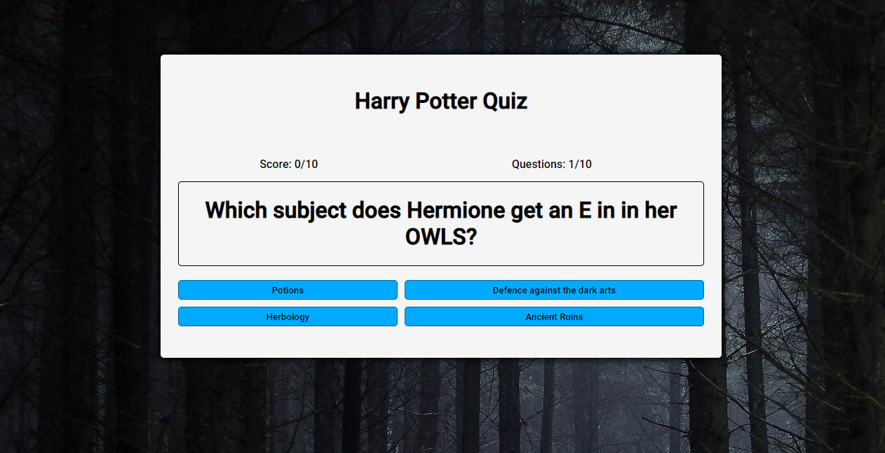

- **Answering a Question Wrong**
    - When the user gets an answer wrong the buttons for wrong answers all turn red and no point is scored in the score section on the top left above the question.  

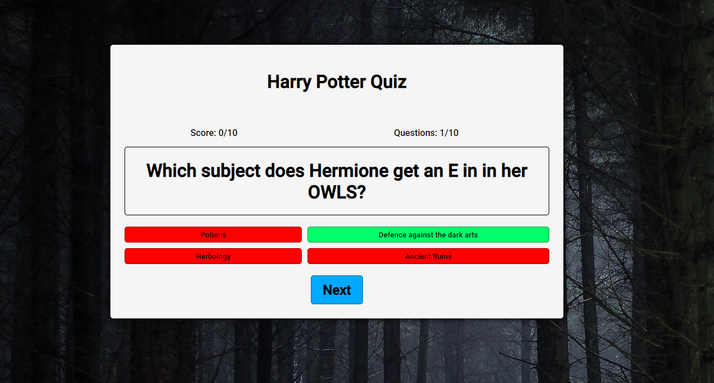

- **Answering a Question Right**
    - When the user gets an answer right they will see that the asnwer for their button goes green and the score increases by 1 on the scoreboard.   

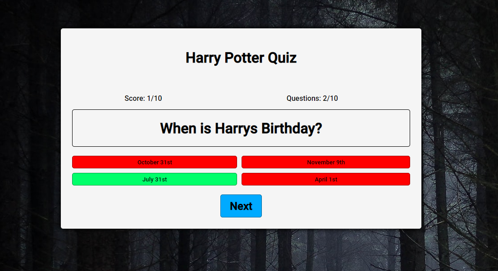

- **Playing the Quiz**
    - The player will go through the quiz with the above happening. Question will increase by 1 with each question & score will increase by 1 with each right answer until all 10 questions have been answered.  

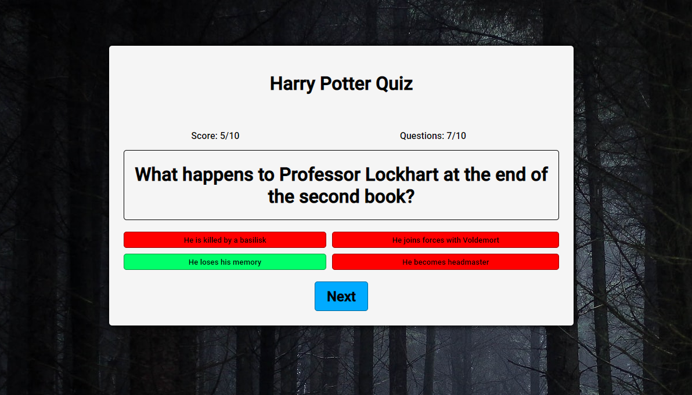

- **End of Quiz**
    - When the 10 questions of the quiz have been answered the final score is tallied and displayed at the bottom. The player can then choose to restart the quiz if they wish to do so. 

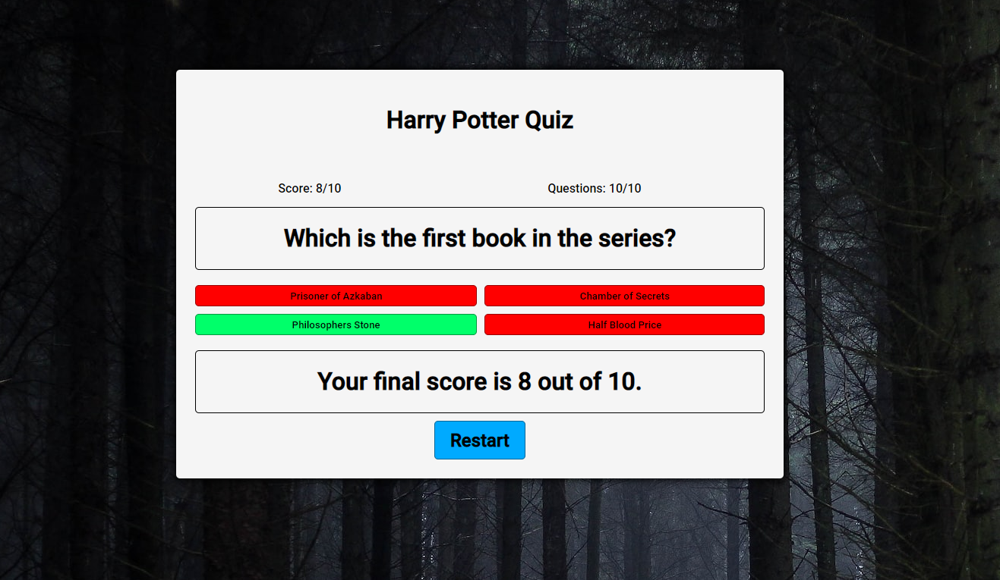

### Features Left to Implement
- Implement more quizzes onto the site. Users will be able to select niche subjects within the Harry Potter World and take quizzes on the likes of Gryffindor history for example. 
- The more questions implemented the more random the quizzes would become as no 1 quiz round would ever be the same.  
- Implement a leaderboard and a play against friends feature. 

## Testing 
- Once the site was deployed I tested it manually on various browsers - Chrome, Safari, Edge, Firefox and it was compatible on all. 
- I confirmed that the site works well and is responsive & functions in all browsers at the various different screen sizes from large to small.
- I also tested the site on various devices - android phone, iPhone, iPad and the site works & is responsive on all. 

**Examples of Screen Shots of Testing**
- Safari  on iPad portrait
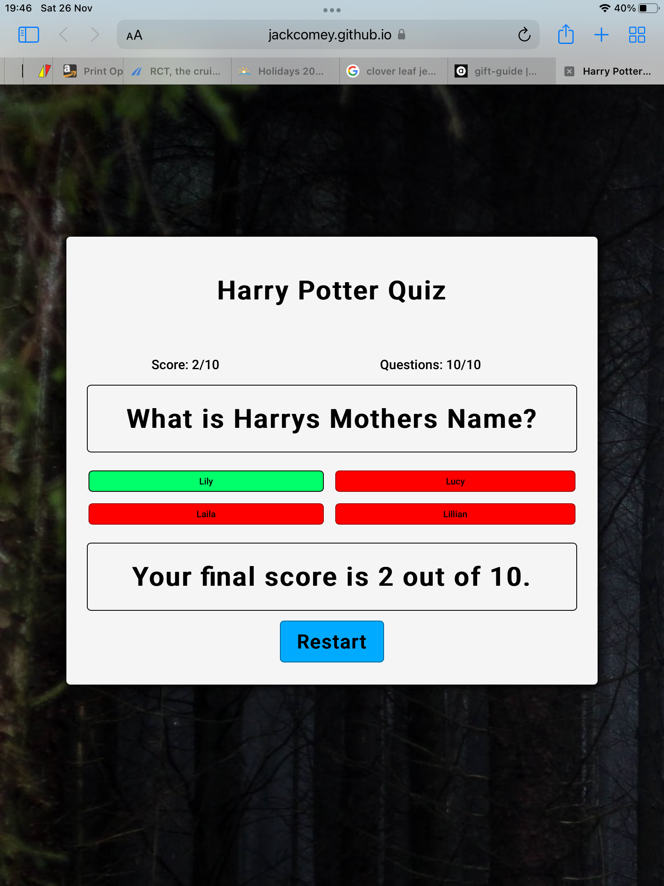
- Safari  on iPad landscape
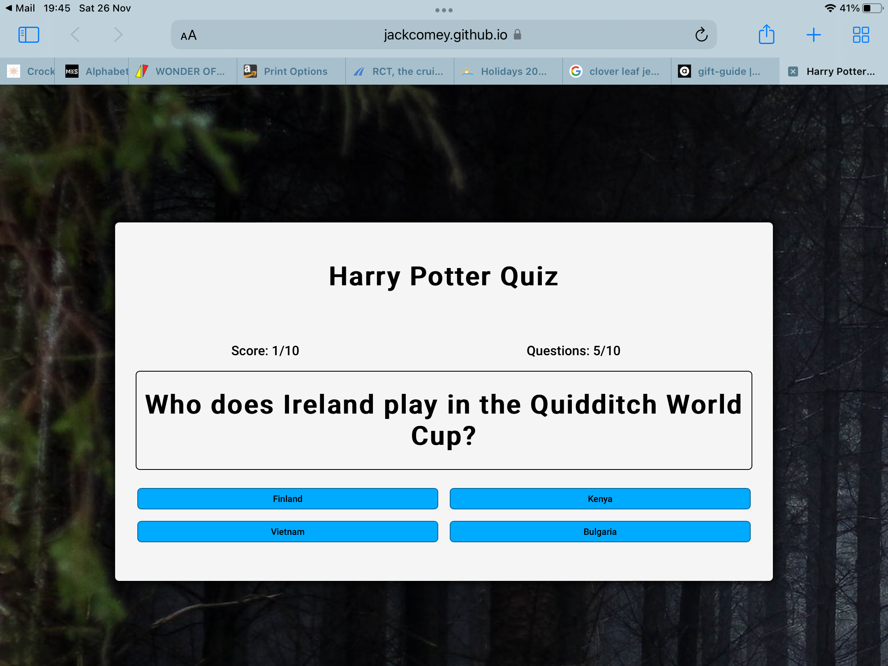
- Chrome  on Android phone
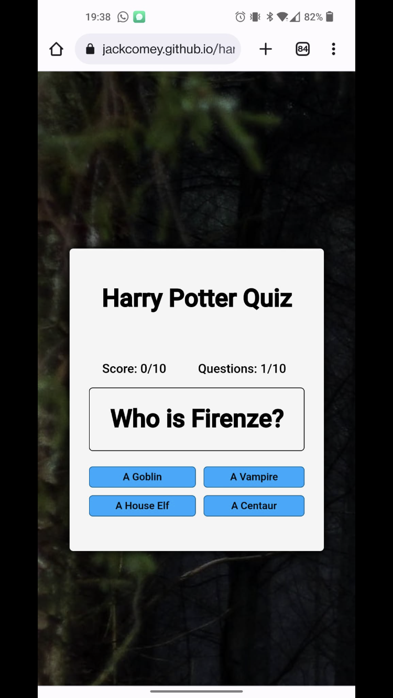

### Validator Testing
- HTML
    - No errors were returned when passing any of the HTML through the [W3C validator](https://validator.w3.org/nu/?doc=https%3A%2F%2Fjackcomey.github.io%2Fharry-potter-quiz%2Findex.html)
- CSS 
    - No errors were found when passing the CSS through the official [(Jigsaw) Validator](https://jigsaw.w3.org/css-validator/validator?uri=https%3A%2F%2Fjackcomey.github.io%2Fharry-potter-quiz%2Fassets%2Fcss%2Fstyle.css&profile=css3svg&usermedium=all&warning=1&vextwarning=&lang=en)
- JavaScript
    - No errors were found when passing the JavaScript through [JS HINT](https://jshint.com/)
    - script.js file
    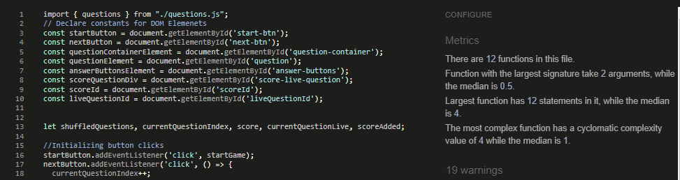
    - questions.js file
    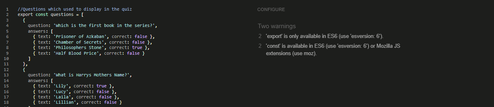

- Lighthouse Scores
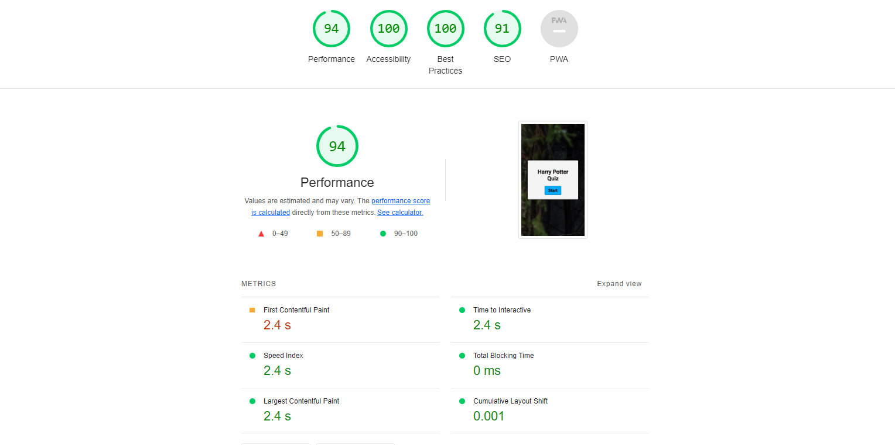

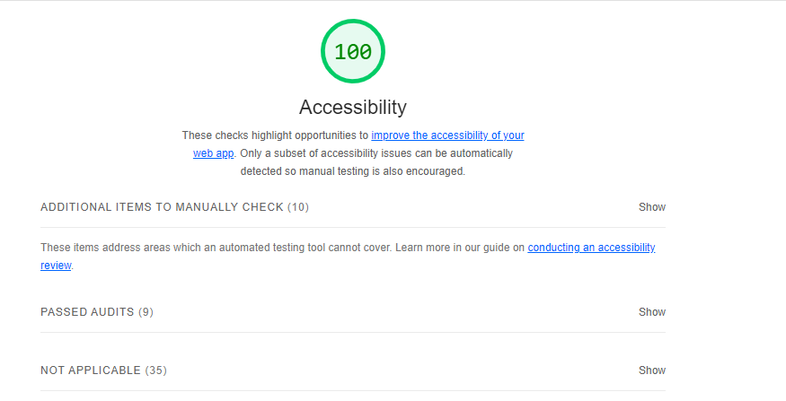

## Bugs & Unfixed Bugs
- When the site was first deployed I had the quiz questions mixed in with the script.js file. I decided to create a questions.js file to have best practices in place here and a cleaner look for the code. When I first tried this method it was not linking the questions back up. This was due to me not having the type=”module” linked in the script tags on the HTML page as well as not having the proper import & export commands in the new questions.js & script.js files. After implementing everything linked up.  
- There were no further bugs after this. 

## Deployment 
- **Cloning/Forking**
    - To clone or fork the project go to the top of the repository & click on the cloning button. 
    - Or from the code drop down choose to download a zip file containing the code or use the Git link to manually clone. 

- **Local Deployment**
    - Navigate to [Gitpod.io](https://gitpod.io/) and create an account. 
    - Download & install the appropriate extension for the browser of your choice. 
    - Return to this repository and click on the green Gitpod button. This will open the code in a new workspace. 

- **Remote Deployment**
    - The site was deployed to GitHub pages. The steps to deploy were the below:
    - In the GitHub repository go to the Settings tab. 
    - Click on pages tab on the left hand side.  
    - From sources click the drop down & select Main Branch. 
    - Once the main branch has been selected, the page will be refreshed with a detailed ribbon display to indicate the successful deployment. The page provided the link to the completed website. 

The live link can be found here - (https://jackcomey.github.io/harry-potter-quiz/)

## Credits

**Content**
- The content of the questions was form a Harry Potter quiz found on the [Beano](https://www.beano.com/).  
- I drew a lot of inspiration from YouTube to be able to bring together the various parts of the JavaScript & how everything flowed together.  [Coding Nepal](https://www.youtube.com/watch?v=pQr4O1OITJo) and [Web Dev Simplified](https://www.youtube.com/watch?v=riDzcEQbX6k) were quite important videos for me with this project. 

**Media**
- The image on the site is from the open source website [Unsplash](https://unsplash.com/)